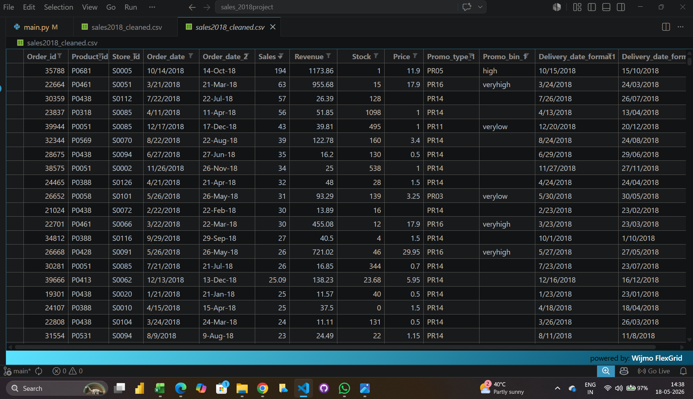

# 📊 Sales 2018 Data Cleaning Project (Python | Pandas)

## 📌 Project Overview
This project focuses on cleaning and preprocessing the 2018 sales dataset using Python and Pandas.  
The objective is to remove unnecessary data, handle missing values, and prepare the dataset for analysis and reporting.

---

## 🧹 Data Cleaning Workflow

### 1. Dataset Loading
- Loaded raw dataset (`sales2018.csv`)
- Imported dataset using Pandas

### 2. Data Inspection
- Displayed first 5 rows using `head()`
- Checked dataset structure using `info()`
- Verified dataset shape
- Analyzed missing values

### 3. Data Cleaning Operations
- Removed unnecessary columns:
  - `promo_bin_2`
  - `promo_discount_2`
  - `promo_type_2`
- Removed duplicate rows
- Filled missing values in `promo_bin_1`

### 4. Export Cleaned Dataset
- Saved cleaned dataset as `sales2018_cleaned.csv`

---

## 🛠️ Tools & Technologies Used
- Python  
- Pandas  
- VS Code  

---

## 📁 Output File
- `sales2018_cleaned.csv` → Final cleaned dataset

## 📸 Project Output Preview

---

## 🎯 Key Outcome
The dataset was successfully cleaned by removing duplicates, handling missing values, and dropping irrelevant columns, making it ready for further data analysis and business insights.

---

## 👩‍💻 Author
Pragya Malviya
